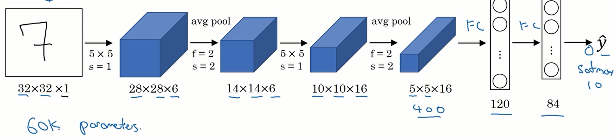
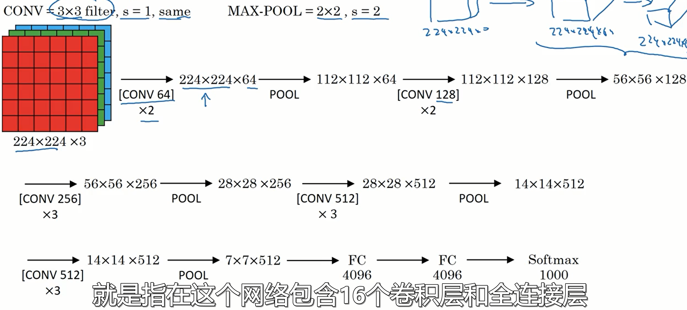

### 经典卷积网络

#### LeNet-5

输入是32\*32\*1的灰度图，然后经过6个步长为1，大小为5\*5的卷积核，得到28\*28\*6。然后经过步长为2，宽度为2的过滤器，得到14\*14\*6，然后使用16个5\*5的卷积核，得到10\*10\*16,

在论文提出的年代，人们更喜欢使用average pooling，现在人们更喜欢max pooling。论文完成于1998年，那时人们不怎么使用padding。然后再经过池化层，得到5\*5\*16，然后经过有120个节点的全连接层，然后经过有84个节点的全连接层，得到最后的预测值（最后并没有Softmax层)。

最后总的参数量大小为60k。

#### AlexNet

AlexNet使用的激活函数是Relu。参数量是60M。

#### VGG16

16表示这个网络包含16个卷积层和全连接层，参数量是1.38亿。

网络结构规整，池化层缩小图象的高度和宽度，卷积层不改变图象的大小。卷积层的过滤器数量存在一定规律。每次池化，刚好缩小一半，而信道数量在不断增加。

